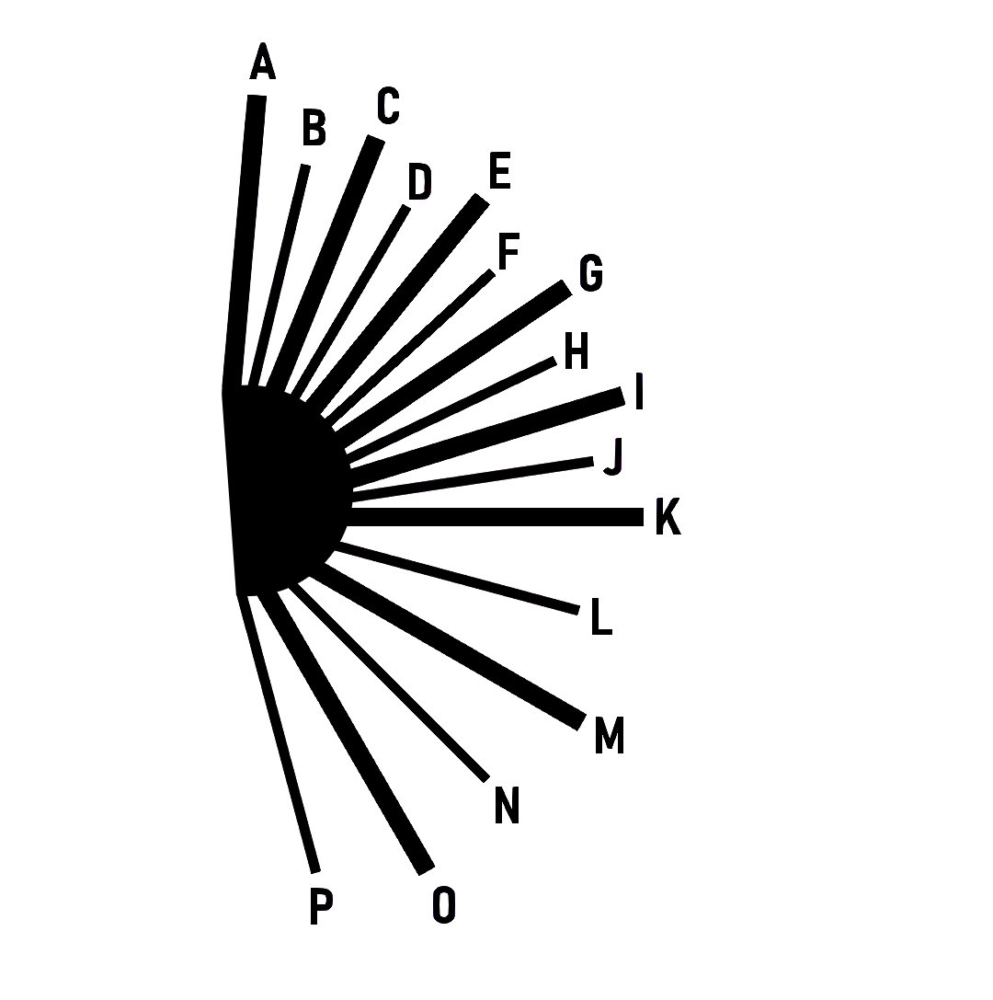

# Beta ohne Gewähr. Backup machen. Freu mich über Bugreports

# Deutsche Calls
- Alles was "schmal" ist bezieht sich auf die Strassenbreite
- Enger, Verengt usw. bezieht sich auf Kurven
- Quetscht bedeutet [Sumppu](Plugins/Pacenote/Bilder/sumppu.png)
- Überhöht = positive Camber
- Schiebt =negative Camber
- Schikane links o. rechts = auf dieser Seite ist die Einfahrt in die Schikane

# Skala:

Das Bild ist eine Legende für die Skalentabelle unten. Die Winkel entsprechen in etwa [Luppis Pacenote Pack V3](https://discord.com/channels/723091638951608320/1106176825442435142/1106176825442435142). Andere Pacenotes, insbesondere originale können vom Winkel her stark abweichen, aber die Reihenfolge der Calls stimmt trotzdem. Es gibt erstmal nur eine Skala, mehr kommen im Laufe der Zeit. Wenn du eine bestimmte Skala möchtest, mach einfach eine Issue auf.

| X | Skala 1        |
|---| ---------------|
| A | Voll L/R       |
| B | 6 L/R Plus     |
| C | 6 L/R          |
| D | 5 L/R Plus     |
| E | 5 L/R          |
| F | 4 L/R Plus     |
| G | 4 L/R          |
| H | 3 L/R Plus     |
| I | 3 L/R          |
| J | 90 L/R Plus    |
| K | 90 L/R         |
| L | 1 L/R Plus     |
| M | 1 L/R          |
| N | Kehre L/R Plus |
| O | Kehre L/R      |
| P | Spitz L/R      |

# Installation
Zuerst oben links unter dem grün unterlegtem "Code" die Dateien als .zip herunterladen

Backup machen: Im deinem RBR-Ordner den Ordner "Audio" und im Ordner Plugins den Ordner "Pacenote" folgendermassen kopieren: Rechte Maustaste auf den Verzeichnisnamen, dann kopieren, dann einfügen. Jetzt sollten sich im RBR Ordner ein neuer Eintrag "Audio-Kopie" und im Plugins Ordner eim Eintrag "Pacenote-Kopie" befinden.

Danach das heruntergeladene zip in Dein RBR Verzeichnis entpacken. Bei der Nachfrage ob Dateien überschrieben werden sollen mit "Ja" antworten.

# De-Installation
Den Ordner RBR-Ordner\Audio und RBR-Ordner\Plugins\Pacenote löschen und dann die bei der Installation kopierten Ordner wieder in Audio und Pacenote umbenennen

